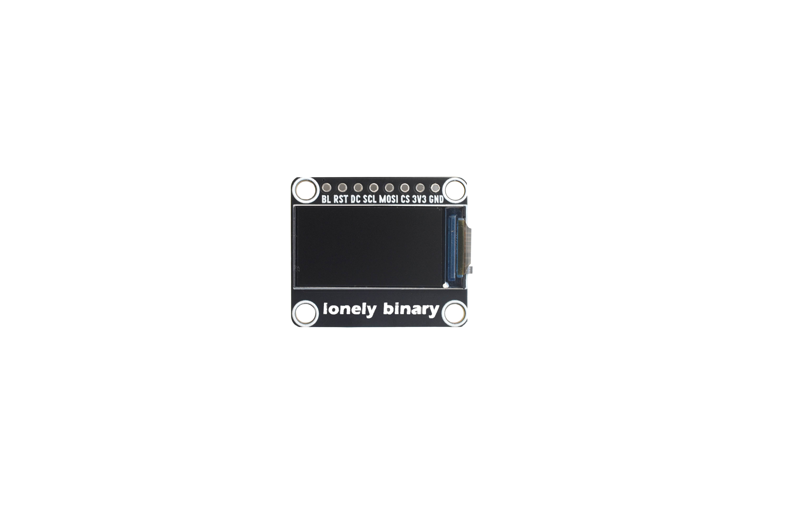
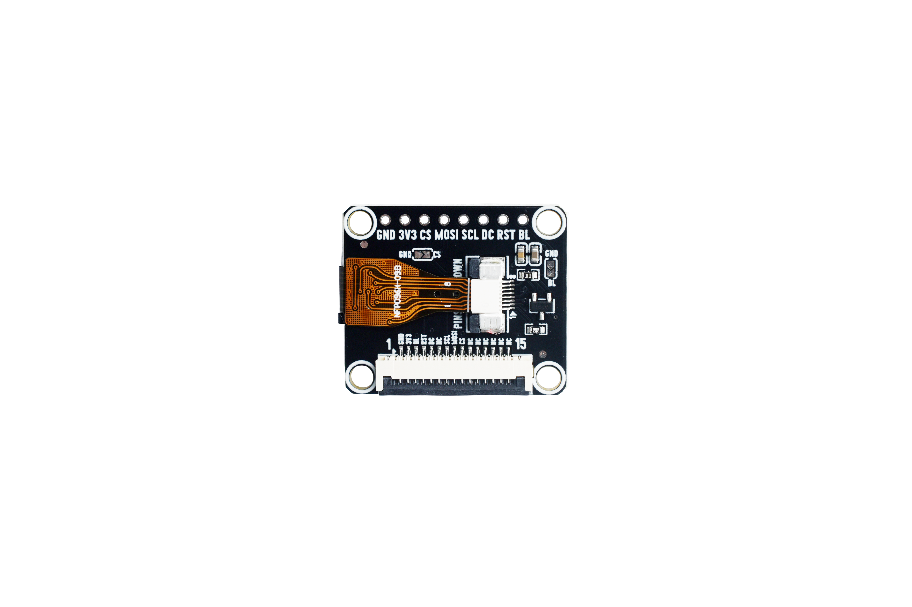

# 0.96 Inch TFT-LCD Display

A tiny 0.96-inch color display for your ESP32 projects. This page covers the specs and wiring for this size. For full setup steps, see the [TFT-LCD series README](../README.md).

## Photos

**Front**

**Back**

## The basics

- **Driver chip:** ST7735S
- **Resolution:** 80 × 160 pixels
- **Colors:** 16-bit (65,536 colors)
- **Connection:** SPI (a fast, simple way to talk to the screen)
- **Power:** 3.3V only (never 5V)
- **Touch:** no — this is a display-only module
- **Screen size:** about 19.2mm × 9.6mm

> **One thing to know about this size:** the 0.96-inch panel is "normally black", so in the example sketch the IPS setting must stay `false`. If it's set to `true`, colors come out wrong (red looks blue). The example already has this right — you don't need to change anything.

## How to wire it up

These are the 8 wires between the display and your board. **Which GPIO numbers to use depends on your board** — pick the column that matches the board you have.

| Display pin | ESP32-S3 (default) | Classic ESP32 | What it does |
|-------------|--------------------|---------------|--------------|
| VCC / VDD | 3.3V | 3.3V | Power (use 3.3V, **never 5V**) |
| GND | GND | GND | Ground |
| CS | GPIO 10 | GPIO 15 | Chip select |
| RST | GPIO 42 | GPIO 4 | Reset |
| DC | GPIO 2 | GPIO 2 | Data/command select |
| MOSI / SDA | GPIO 11 | GPIO 23 | SPI data |
| SCLK / SCL | GPIO 12 | GPIO 18 | SPI clock |
| BLK / LEDA | GPIO 41 | GPIO 32 | Backlight |

**You don't edit the code to switch boards.** The sketch already contains both pin sets and picks the right one automatically based on the board you select in the Arduino IDE (`#if defined(CONFIG_IDF_TARGET_ESP32S3)`). Just choose **ESP32S3 Dev Module** for an ESP32-S3, or **ESP32 Dev Module** for a classic ESP32 (such as the Lonely Binary PinPulse).

> **Why are the pin numbers different?** The classic ESP32 doesn't have GPIO 41 or 42, and its GPIO 6–11 are reserved for internal flash memory — so the ESP32-S3 pins can't be reused. The classic ESP32 column uses its standard hardware-SPI pins instead.

> **Backlight on this size is special:** for the 0.96-inch module, `LOW` turns the backlight ON (every other size uses `HIGH`). It's still simple on/off — there's no brightness control. The example handles this for you.

## Adjusting the picture position (offset)

Small displays sometimes need a tiny nudge so the image sits in the right spot. This size ships with a **column offset of 24** and a **row offset of 0**. If your picture looks shifted, you can fine-tune these `col offset` / `row offset` values near the top of the sketch:

- Lower the column offset to move left, raise it to move right (usually 20–30).
- Lower the row offset to move up, raise it to move down (usually 0–5).

Different batches can vary slightly, so a small adjustment is normal.

## Try it out

1. Open `code/0.96inch_Test/0.96inch_Test.ino` in the Arduino IDE.
2. Select your board (**ESP32S3 Dev Module** or **ESP32 Dev Module**) and the right port.
3. Click Upload.

The test sketch shows the LonelyBinary name, eight color bars, and the screen details at the bottom — a quick way to confirm everything works.

New here? The full step-by-step setup (installing the IDE, the ESP32 boards, and the display library) lives in the [TFT-LCD series README](../README.md). Ready to write your own code? Work through the beginner lessons in [`tutorials/3.5inch/`](../../tutorials/3.5inch/README.md), and use this size's `ADAPTATION_GUIDE.md` to adjust them for the 0.96-inch screen.

## Library versions

The examples were tested with the **latest** Arduino ESP32 core and the **latest** GFX Library for Arduino, and they also work with the older ESP32 core 2.0.17 + GFX 1.6.4. Use whichever versions you have — they all work. (The sketch has a tiny color-compatibility helper so it builds on old and new GFX versions; you never need to touch it.)

## If something isn't working

**Screen stays black**
- Re-check every wire, especially **DC** and **RST**.
- Make sure power is **3.3V**, not 5V.
- Confirm you picked the matching board (ESP32S3 Dev Module vs ESP32 Dev Module).

**Picture looks shifted**
- Adjust the `col offset` / `row offset` values as described above.

**Colors look wrong**
- For this size, the IPS setting must stay `false` (the example already does this).

**Upload fails**
- Pick the correct port under **Tools → Port**. Some boards need you to hold **BOOT** while uploading.

## License

MIT License
